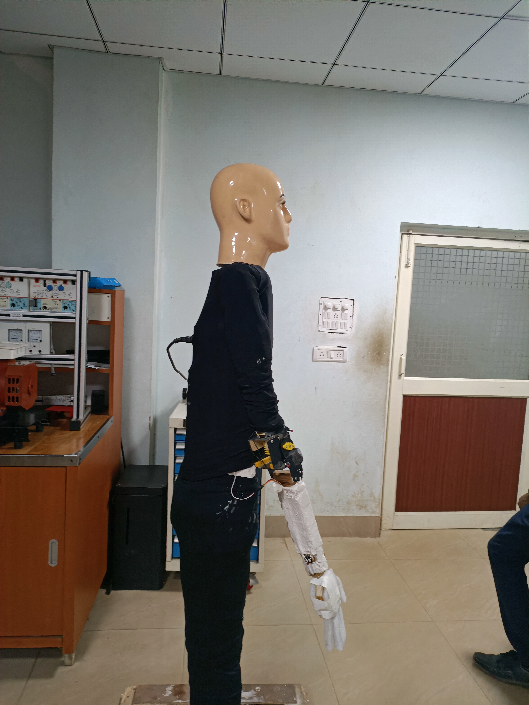
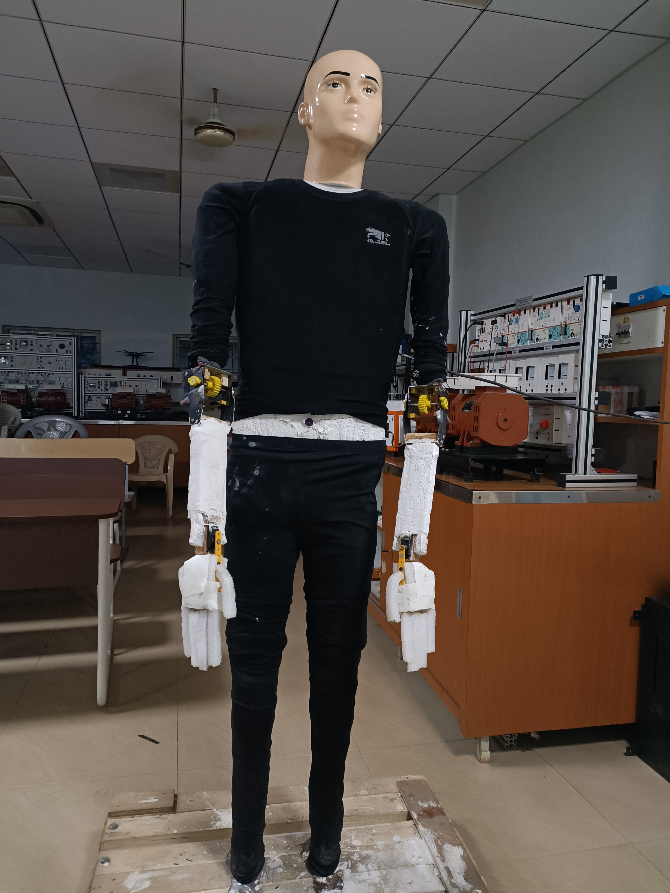
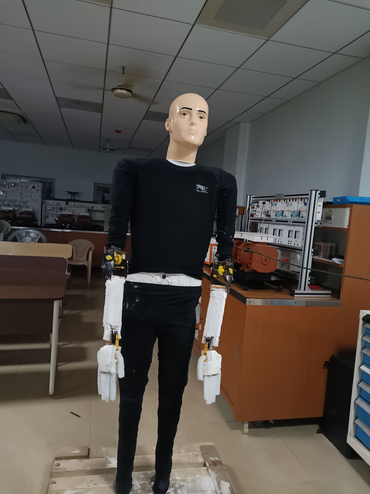
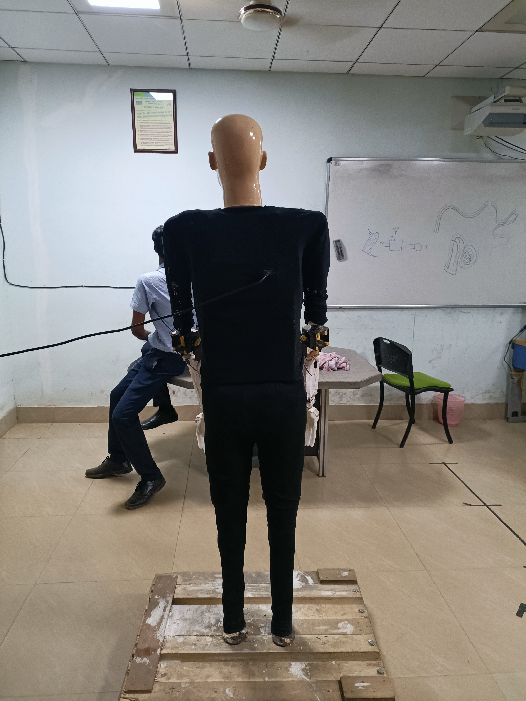

# Greeting Humanoid Robot (Arduino)

This project implements a static greeting humanoid robot using Arduino and various electronic components. The robot is designed to detect a person's presence using a proximity sensor, which then triggers a greeting motion using servo motors. The movement of the robot's joints is controlled and limited by reed and limit switches.

## Overview

The robot utilizes a combination of sensing, actuation, and control mechanisms to achieve the greeting behavior. The system architecture is as follows:

1. **Human Detection:** A proximity sensor detects the presence of a person within a certain range.
2. **Signal to Arduino:** The sensor sends a signal to the Arduino board, indicating the presence of a person.
3. **Motor Control:** The Arduino processes the signal and controls the servo motors to initiate a greeting motion.
4. **Joint Limit Control:** Reed and limit switches are strategically placed in the robot's joints to restrict the range of motion and prevent damage.

## Implementation Details

### Robot Structure

The robot is a static structure with articulated joints. Key components include:

- **Proximity Sensor:** Detects the presence of a person.
- **Arduino Board:**  The main control unit that processes sensor data and controls the motors.
- **Servo Motors:** Used for actuating the robot's joints, specifically the elbow and wrist.
- **Steeper Motor:** Used in the elbow joint for precise control.
- **Reed and Limit Switches:** Placed in the joints to limit movement and ensure safety.
- **Worm and Worm Wheel Mechanism:** Used in certain joints for increased torque and precision.
- **SMPS (Switch Mode Power Supply):** Regulates and controls the power flow to the robot's components.

### Arduino Code

The Arduino code is responsible for:

- Reading the sensor input.
- Controlling the servo motors based on the sensor state.
- Monitoring the limit switches to restrict joint movement.

```c++
// Arduino code (included as provided in the original prompt)
cttc.hand.ino // code
```

### Photos while working

 

 



### Limitations

- **Static Robot:** The current implementation is a static robot; it cannot move from its position.

- **Basic Greeting:** The greeting motion is limited to pre-programmed arm movements.

### Future Work

- **Mobility:** Implementing a mobile base for the robot to enable movement.

- **Advanced Interactions:** Incorporating more complex greeting behaviors, such as speech or gesture recognition.

- **Object Recognition:** Adding object recognition capabilities to allow the robot to interact with its environment.

### License

- **Open source**


